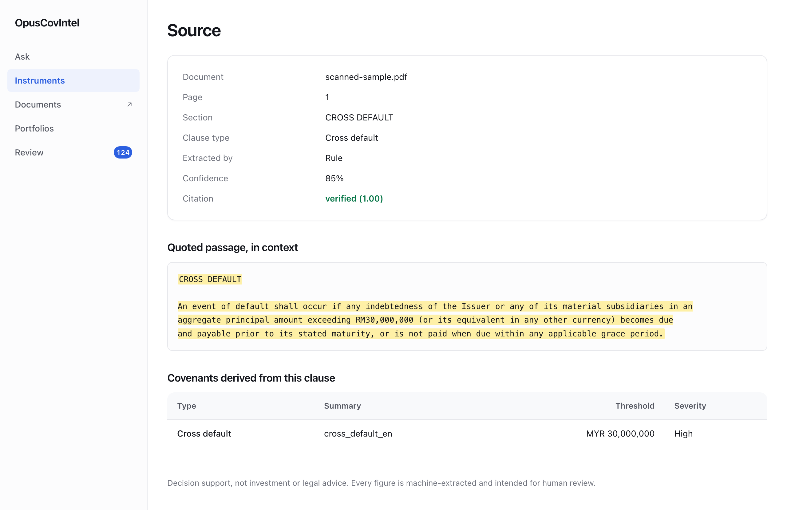

# OpusCovIntel

[](https://github.com/amdhd/OpusCoveIntel/actions/workflows/ci.yml)

**Read a bond prospectus so an analyst doesn't have to — and show your working.**

OpusCovIntel reads sukuk and bond documents (prospectuses, trust deeds, rating reports), pulls
out the promises the issuer made, and lets you ask questions about them across a whole portfolio.
Every answer links back to the exact sentence on the exact page it came from.



*Every extracted figure is one click from this screen. `verified (1.00)` means the model's quote
was checked against the stored chunk — not taken on trust.*

---

## The problem

A Malaysian fixed-income fund might hold 200 bonds. Each one comes with a 300–600 page legal
document containing **covenants** — binding promises the issuer made, such as:

> *"An event of default shall occur if any indebtedness of the Issuer exceeding **RM30,000,000**
> becomes due and payable prior to its stated maturity."*

When a credit rating gets downgraded, someone has to answer *"which of our holdings just tripped a
covenant?"* within hours. Today that means analysts reading PDFs by hand. The answers exist, but
they're buried across thousands of pages, and the cost of missing one is a portfolio that breached
a limit nobody noticed.

## What makes it different from "chat with your PDF"

This is built for an audit, not a demo. Four rules are enforced in code, not in a prompt:

| Rule | Why it matters |
|---|---|
| **The AI never decides a breach** | Models read text and pull out numbers. Whether `1.9 > 1.75` is a breach is decided by plain Python in [`app/rules/`](app/rules/covenants.py), which is unit-tested and reproducible. An AI that computes compliance is an AI that can hallucinate compliance. |
| **Every fact traces to a source** | `covenant → clause → chunk → (page, character offsets)`. A covenant that cannot name its page and quote is rejected before it reaches the database. |
| **Quotes are checked, not trusted** | The model returns a quote; we verify that quote actually appears in the chunk we gave it. If it doesn't, the extraction goes to a human instead of into the database. |
| **"I don't know" is a valid answer** | If there's no supporting evidence, the system says so with confidence `0.0` rather than guessing. A confident wrong answer about a covenant is worse than no answer. |

There's a fifth, quieter one: **"could not evaluate" and "compliant" are never merged**. If a
covenant couldn't be checked because a figure wasn't reported, the output says that explicitly.
Silently treating unknown as fine is the most dangerous thing this system could do.

## How it works

```
PDF
 │
 ▼
┌─────────────┐   PyMuPDF + pdfplumber. Scores every page for text quality;
│  Ingest     │   pages that fail (scanned, image-heavy, garbled) are flagged
└─────────────┘   for the vision model. Costs $0.
 │
 ▼  chunks, each remembering (page, char_start, char_end)
┌─────────────┐   Regex + full-text search + vector similarity narrow
│  Narrow     │   ~500 pages down to ~50 candidate passages.
└─────────────┘   This is the main cost lever — ~20x saving.
 │
 ▼
┌─────────────┐   Two extractors run in parallel on every candidate:
│  Extract    │   • regex rules  ($0, deterministic)
└─────────────┘   • Claude Opus  (handles language regex can't)
 │                Where they disagree → human review, free signal.
 ▼  verified quotes only
┌─────────────┐   PostgreSQL: instruments, covenants, rating triggers,
│  Store      │   call schedules, portfolio holdings.
└─────────────┘
 │
 ▼
┌─────────────┐   LangGraph agent: classify → retrieve → evaluate with the
│  Ask        │   rules engine → answer → verify every claim → log.
└─────────────┘   Refuses when evidence is missing.
```

---

## Quick start

```bash
make install     # create .venv (Python 3.12) and .env
make up          # start postgres+pgvector, api, worker
make migrate     # apply the schema
make seed        # load synthetic demo data
make user-add u=yourname role=reviewer
```

Then open <http://localhost:8000>.

To watch the whole pipeline run end to end for **$0** — no API keys needed:

```bash
make demo
```

That ingests a synthetic prospectus, indexes it, extracts covenants with the regex extractor, and
answers thirteen benchmark questions without calling any model.

<details>
<summary><b>Loading your own documents</b></summary>

Parsing is free and needs no API key.

```bash
uv run opuscovintel ingest path/to/prospectus.pdf
uv run opuscovintel index          # build the search indexes
```

Or upload from the browser at `/app/documents` (build it first with `make frontend`). The screen
reports transfer progress, then polls ingestion until the worker is done, and shows the failure
reason if a document cannot be parsed. Uploading the same file twice is not an error: documents are
identified by SHA-256, so a repeat returns the existing record.
</details>

### Running the AI extractor — the one thing that costs money

Price it first. This is free, dispatches nothing, and cannot spend:

```bash
make cost-preview
```

```
19 candidate span(s), ~95,695 prompt tokens, worst case $4.2785 (cap $5.00)
93 candidate span(s), ~467,917 prompt tokens, worst case $20.9396 (cap $5.00)
  ** exceeds the per-document cap; refused before the first call, $0 **
```

A document priced above the cap is **refused before the first call**, not aborted halfway — a
partial extraction you paid for is worse than a clean refusal. Then run one document, and read the
bill before doing more:

```bash
uv run opuscovintel extract <document-id>
make cost-report
```

---

## Cost control

The design assumption is that an ungoverned pipeline over 600-page documents will quietly spend
hundreds of dollars. So spend is **capped**, not merely logged.

| Guard | Default | What happens |
|---|---|---|
| Per document | `$5.00` | Refused before the first call if the estimate exceeds it |
| Per call | `$0.50` | Rejected before dispatch |
| Global | `$10.00` | Circuit breaker — all calls refused |
| Vision-model pages per document | `40` | Fails loudly rather than silently truncating |

The per-document cap is deliberately half the global one, so no single document can exhaust the
budget.

Three things keep the bill down: **candidate narrowing** (the model sees ~50 passages, never 600
pages — roughly 20×, the single biggest lever), **prompt caching** (a byte-stable prefix bills at
0.1× on repeat calls), and a **response cache** keyed on content hash, so re-running an unchanged
pipeline costs $0.

**Measured on three real prospectuses** (1,216 pages):

| Document | Pages | Candidates | Estimated ceiling | Actual |
|---|---|---|---|---|
| 2021 trust certificate | 535 | 93 | $20.94 | refused — over cap |
| Dubai base prospectus | 201 | 51 | $11.48 | refused — over cap |
| 2025 GMTN | 480 | 19 | $4.28 | **$0.39** |

The estimator prices every reply at its full token budget, because that is what the budget guard
assumes. On the one document that has actually run, real spend came in at **9% of the ceiling** —
useful for setting caps, useless as a forecast.

<details>
<summary><b>Which API keys you actually need</b></summary>

| Provider | Required? | Used for |
|---|---|---|
| **Anthropic** | **Yes** | Covenant extraction. The only stage that needs a key to work. |
| **OpenAI** | Only for scans | Vision fallback for pages with no text layer. Typically a handful of pages (~$0.02 each). |
| **Qwen / DashScope** | Optional | Embeddings. Without it the system falls back to a free offline embedder — search still works, but semantic matching is much weaker. |

Everything except extraction and vision OCR runs at $0, including the entire test suite.
</details>

---

## Testing

```bash
make check    # lint + type check + 990 tests
make eval     # score extraction accuracy -> var/evals/
make audit    # known vulnerabilities in the Python and client trees
```

- **`make test` makes zero paid API calls.** Structurally, not by convention: billable tests are
  marked and skipped unless `RUN_LIVE_LLM_TESTS=1`, and CI is given no provider credentials at all.
  It fails the build if one is ever added.
- Tests run against a **dedicated** `opuscovintel_test` database, isolated by transaction rollback,
  so they never touch your development data.
- Six CI jobs, one per reason a build can be wrong: code, schema, accuracy, client bundle, container,
  and dependencies. The schema job runs a full **migration round-trip** (`upgrade` → `downgrade
  base` → `upgrade` plus a drift check); the container job asserts `/health` returns 200 while
  `/ready` returns 503 with no database.

`make eval` scores both extractors separately, because the whole point of running two is being able
to answer *"did the AI actually help?"* Current figures on the synthetic corpus:

| Extractor | Precision | Recall | F1 |
|---|---|---|---|
| Regex rules | 1.00 | 1.00 | **1.00** |
| Claude Opus | 0.93 | 1.00 | **0.96** |

Thirteen benchmark questions pass on both read paths, with faithfulness 1.00 and refusal F1 1.00.

**On documents written to be extractable, regex wins.** That is exactly what a free baseline is
for, and exactly the claim that needs re-testing against real prospectuses. Every report says so on
its first line.

---

<details>
<summary><b>Technology choices, and what was deliberately left out</b></summary>

| Layer | Choice | Why this one |
|---|---|---|
| **Language** | Python 3.12 | Full type hints; `mypy --strict` on the pure-logic modules. |
| **API** | FastAPI + Pydantic v2 | Request/response validation from the same types the domain uses. |
| **Database** | PostgreSQL 16 + `pgvector` | One database for relational data, full-text search *and* vectors. A separate vector store would mean two systems to keep consistent, for a corpus this size. |
| **ORM** | SQLAlchemy 2.x (async) + Alembic | Async throughout; migrations are reviewed code, not auto-applied drift. |
| **Retrieval** | Hybrid: `pgvector` HNSW + Postgres `tsvector`, fused by Reciprocal Rank Fusion | Legal text needs exact keyword matching (`"RM30,000,000"`) *and* semantic search (`"gearing"` ≈ `"leverage ratio"`). Either alone misses. |
| **Agent** | LangGraph | An explicit state graph, so the reasoning path is inspectable and each node testable — not a loop of opaque tool calls. |
| **LLM** | Claude Opus (`claude-opus-5`) | Long-context legal reasoning with structured output. Routed through one module with hard budget caps. |
| **UI** | Jinja for the read screens; **Angular 20** for the interactive ones | Reading a covenant needs no client-side state, and server rendering keeps the citation markup one hop from the database. Uploading a 500-page PDF does need state. Both are served from one origin, so the session cookie stays `HttpOnly` and `SameSite=lax`. |
| **Auth** | Server-side sessions, `hashlib.scrypt` | No dependency; sessions are revocable rows, which a signed cookie isn't. |
| **Background work** | A Postgres table polled with `FOR UPDATE SKIP LOCKED` | At this volume a broker is operational surface with no benefit. Revisit when job volume justifies it. |
| **Packaging** | `uv`, multi-stage Docker, non-root | Locked dependencies; the runtime image contains no build tooling. |

**Deliberately not used:** Redis, Celery, MinIO, Kubernetes, a vector database. Each was
considered and declined — the reasoning is in [docs/plan.md](docs/plan.md). They can be added when
something actually needs them.

A frontend framework was on that list until the upload screen needed one. Read-only pages have no
client-side state worth managing, so they stayed on Jinja; live upload and ingestion progress do,
and rebuilding four working pages to get one new screen would have been the more expensive mistake.
Both UIs share one stylesheet — the Angular build references
[`app/web/static/app.css`](app/web/static/app.css) rather than copying it.

Angular stays on 20 on purpose: v21+ requires Node ≥24.15, above this project's floor. That is a
deliberate upgrade, not a dependency bump.
</details>

<details>
<summary><b>Security</b></summary>

- **Everything requires a login** except `/health`, `/ready` and the login page.
- **Two roles.** `analyst` reads and asks; `reviewer` can also decide review-queue items — the one
  action where a human overrides the machine.
- **Who approved what is not self-reported.** The reviewer recorded on a decision comes from the
  session, not from the request body, so the audit trail can't be forged by a client.
- **Passwords** use `hashlib.scrypt` (memory-hard) with per-password parameters stored alongside
  the hash, so cost can be raised later without invalidating anyone. Minimum twelve characters —
  length only, no "one symbol, one digit" rules.
- **Repeated failed logins back off**, per username and per client address, doubling up to a cap.
  Backoff rather than lockout, so knowing someone's username is not a way to lock them out.
- **Sessions** are revocable database rows. Only a SHA-256 of the token is stored, so a database
  dump doesn't hand over live sessions.
- **The query agent connects as a read-only Postgres role.** Generated SQL is parsed with
  `sqlglot`, checked against a table *and column* allowlist, capped with `LIMIT`, and bounded by a
  statement timeout. The grant is the real boundary; the parser is defence in depth. The role is
  denied the operational tables outright — the audit trail, the review queue, other people's
  questions and the cached model output are not readable by the thing being audited.
- **Security response headers** ship on every response, including errors: a CSP that permits no
  inline script or style, `nosniff`, `DENY` framing, and HSTS once the deployment is HTTPS. The
  strict policy is why the client build inlines no critical CSS — the pages render clause text
  lifted verbatim out of third-party PDFs, so escaping needs a second layer behind it.
- **Login is deliberately uninformative** — wrong password, unknown user and disabled account
  return the same message in the same time, so the endpoint can't be used to enumerate staff.

Remaining gaps are listed honestly in [docs/review.md](docs/review.md); behind a proxy the
per-address half of the login limit needs the client address forwarded
([docs/deploy.md](docs/deploy.md) §6).
</details>

<details>
<summary><b>Project layout and the UI</b></summary>

| Path | Purpose |
|---|---|
| `app/api/` | HTTP routes. No business logic, no SQL. |
| `app/web/` | Server-rendered UI — Jinja templates: ask, instruments, portfolios, source, review. |
| `frontend/` | Angular 20 client app served at `/app` — upload with live ingestion progress, plus ask, instruments and review. Optional: the API runs without it. |
| `app/core/` | Settings, structured logging, request-id and security-header middleware. |
| `app/domain/` | Pydantic schemas and enums. Pure — imports nothing below it. |
| `app/db/` | SQLAlchemy models, repositories, dual (read-write / read-only) engines. |
| `app/ingest/` | PDF parsing, page-quality scoring, chunking, object storage. |
| `app/llm/` | Provider adapters behind a budget guard, response cache, cost ledger. |
| `app/extract/` | Regex + AI extractors, prompts, quote verification, dry-run pricing. |
| `app/rules/` | Deterministic covenant evaluation. Pure functions, heavily tested. |
| `app/retrieval/` | Hybrid search: vectors + full text, fused by reciprocal rank. |
| `app/agent/` | LangGraph query graph and the SQL guardrail. |
| `app/catalog/` | Read-side assembly of instruments, covenants and their provenance. |
| `app/auth/` | Password hashing, sessions, login. |
| `app/evals/` | Benchmark questions, labelled ground truth, metrics harness. |

Dependencies point one way: `api → services → repositories → models`. `domain/` and `rules/` are
leaves that import nothing above them.

**The screens**, server-rendered from the same services the JSON API uses — so the two can never
disagree about what a covenant is:

- **Ask** — question in, answer with clickable citations out. A refusal is shown as an answer, not
  an error, because it is one.
- **Source** — the screenshot at the top. Click any citation to see the quote highlighted inside
  the original text, with the page, how it was extracted, and whether the quote verified. This is
  the screen that makes the audit trail checkable rather than merely recorded.
- **Instruments** — the catalogue, and every covenant extracted from each one.
- **Review queue** — approve, correct or reject flagged extractions.
- **Portfolio** — holdings with covenant status; breaches sort to the top, and anything that
  couldn't be evaluated reads *not reported*, never *ok*. The whole board evaluates in three
  queries, not three per holding.

Long lists page at fifty rows rather than rendering whatever the database happens to hold.
</details>

---

## Status, and what's honest about it

**Phases 1–9 are built and running.** Documents ingest, extract into cited covenants, and answer
portfolio questions through a UI, an API and a CLI. Fourteen of the sixteen findings in the
engineering review are closed, including every High-severity and every security item.

Three things to be clear about:

- **All accuracy figures above are measured against synthetic documents we wrote ourselves.** They
  show the harness works. They do *not* show the extractor is accurate on real prospectuses.
  Re-baselining against a labelled real document is the top priority.
- **The query agent currently makes no model calls** — it's fully deterministic. Answer synthesis
  by a model is designed but not built. [CLAUDE.md](CLAUDE.md)'s routing table marks exactly which
  stages are live, which are wired but uncalled, and which are unbuilt.
- **The first real document was revealing.** Extracting a 480-page GMTN prospectus produced no
  gearing ratio, cross-default, interest cover or finance service cover at all, and put a quarter
  of what it did find in `other` — against a synthetic corpus full of them. That is either a real
  property of this issuer's documents or precisely the "patterns tuned to invented layouts" failure
  the re-baseline exists to catch. Only labels will separate the two.

The prioritised plan, including known bugs, security gaps and cost issues, is in
**[docs/review.md](docs/review.md)**. The phase plan is in [docs/plan.md](docs/plan.md); the architectural
rules that shouldn't be broken are in [CLAUDE.md](CLAUDE.md). Day-to-day operation is in
[docs/operate.md](docs/operate.md) and deployment in [docs/deploy.md](docs/deploy.md).

## Disclaimer

Output is **decision support, not investment or legal advice**, and is intended for human review
before any action is taken. No real prospectuses are committed to this repository — the fixtures
are synthetic, and licensed documents belong in `var/`, which is git-ignored.
